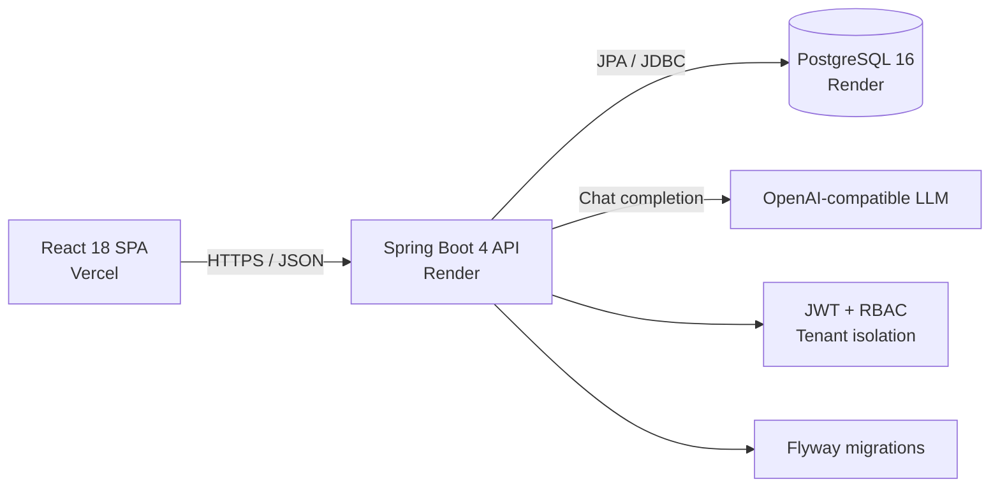

# BookFlow

[](https://github.com/SeanXC/bookflow/actions/workflows/backend-ci.yml)
[](https://github.com/SeanXC/bookflow/actions/workflows/frontend-ci.yml)

BookFlow is a cloud-deployed, multi-tenant appointment management SaaS for
small service businesses. It combines role-based business administration,
staff availability, public self-service booking, and an AI-assisted booking
flow.

**[Open the live application](https://bookflow-theta-flame.vercel.app/)**

No shared demo credentials are published. Create an account to receive an
isolated tenant workspace. The hosted environment uses free-tier infrastructure
and is intended for portfolio demonstration, so the first API request can take
50 seconds or more while Render wakes the service.

## Features

- Tenant-isolated registration, authentication, and business data
- OWNER, RECEPTIONIST, and STAFF role-based access control
- Staff, service, customer, user, and appointment management
- Search, filtering, pagination, customer history, and dashboard analytics
- Weekly staff schedules, breaks, date exceptions, and bookable-slot calculation
- Appointment overlap and staff-availability conflict prevention
- Public booking flow with business slug, service and staff selection, and
  confirmation
- AI booking assistant that proposes real available slots and creates an
  appointment only after explicit confirmation
- OpenAPI documentation in local development
- Automated test, coverage, static-analysis, and build gates in GitHub Actions

## Architecture



The public and authenticated booking flows share the same availability and
conflict-detection domain services. AI output is treated as a proposal rather
than a database command: proposals are tenant-bound, expire after ten minutes,
and are single-use.

## Technology

### Backend

- Java 21 and Spring Boot 4.0.8
- Spring MVC, Spring Data JPA, and Spring Security
- JWT resource-server authentication and method-level RBAC
- PostgreSQL 16 and Flyway
- springdoc-openapi
- JUnit, Mockito, MockMvc, and Testcontainers
- JaCoCo and SpotBugs

### Frontend

- React 18 and JavaScript
- Vite 8 and React Router
- Material UI and MUI Data Grid
- TanStack Query and Axios
- Recharts
- Vitest, Testing Library, and ESLint

### Delivery

- Docker and Docker Compose
- GitHub Actions
- Render Blueprint for the API and PostgreSQL
- Vercel for the frontend

## Local Development

### Prerequisites

- Java 21
- Node.js 24 and npm
- Docker with Docker Compose

### 1. Start PostgreSQL

```bash
docker compose up -d postgres
```

### 2. Start the API

```bash
cd backend
export JWT_SECRET="$(openssl rand -hex 32)"
./mvnw spring-boot:run
```

The API runs at `http://localhost:8080`.

Optional AI configuration:

```bash
export AI_LLM_API_KEY="your-api-key"
export AI_LLM_MODEL="gpt-4o-mini"
```

Set these variables before starting the API. Without an API key, the core
application and standard public booking flow still work; AI requests do not.

### 3. Start the frontend

```bash
cd frontend
npm install
npm run dev
```

Open `http://localhost:5173/register` and create the first business owner.

Local Swagger UI is available at `http://localhost:8080/api/docs`. Swagger and
OpenAPI are disabled in the production profile.

## Environment Variables

| Variable | Purpose | Default |
| --- | --- | --- |
| `JWT_SECRET` | Signs access tokens; use at least 32 random bytes | Required |
| `SPRING_DATASOURCE_URL` | PostgreSQL JDBC URL | `jdbc:postgresql://localhost:5432/bookflow` |
| `SPRING_DATASOURCE_USERNAME` | PostgreSQL username | `bookflow` |
| `SPRING_DATASOURCE_PASSWORD` | PostgreSQL password | `bookflow` |
| `CORS_ALLOWED_ORIGINS` | Comma-separated trusted frontend origins | `http://localhost:5173` |
| `BUSINESS_TIME_ZONE` | Default business timezone | `UTC` |
| `AI_LLM_API_KEY` | OpenAI-compatible provider key | Empty |
| `AI_LLM_BASE_URL` | OpenAI-compatible API base URL | `https://api.openai.com/v1` |
| `AI_LLM_MODEL` | Assistant model | `gpt-4o-mini` |
| `VITE_API_BASE_URL` | API origin used by the frontend build | `http://localhost:8080` |

Never commit real secrets. Any variable prefixed with `VITE_` is embedded in the
browser bundle and must not contain credentials.

## Verification

Run all backend tests, coverage checks, and static analysis:

```bash
cd backend
./mvnw clean verify
```

Run frontend linting, tests with coverage, and a production build:

```bash
cd frontend
npm run lint
npm run test:coverage
npm run build
```

CI enforces a 60% backend line-coverage floor, a 50% frontend line and statement
coverage floor, and zero unexcluded Medium-or-higher SpotBugs findings.

## Project Structure

```text
bookflow/
├── backend/                  Spring Boot API and Flyway migrations
├── frontend/                 React SPA
├── .github/workflows/        Backend and frontend CI
├── docker-compose.yml        Local PostgreSQL
├── render.yaml               Production API and database Blueprint
└── DEPLOYMENT.md             Production deployment and smoke-test guide
```

## Production

- Frontend: [bookflow-theta-flame.vercel.app](https://bookflow-theta-flame.vercel.app/)
- API health: [bookflow-api-atib.onrender.com/api/public/health](https://bookflow-api-atib.onrender.com/api/public/health)

See [DEPLOYMENT.md](DEPLOYMENT.md) for infrastructure configuration and the
production smoke-test checklist.
